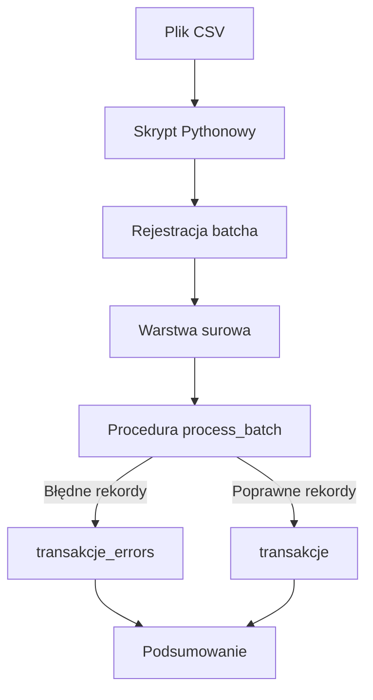
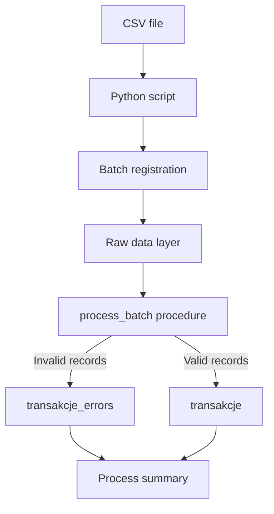

# TransactFlow ETL

[Polski](#polski) | [English](#english)

## Polski

TransactFlow ETL to projekt z zakresu inżynierii danych przedstawiający proces ETL dla danych transakcyjnych z wykorzystaniem Pythona i PostgreSQL.

> **Status:** Projekt realizuje automatyczny przepływ od odczytu pliku CSV, przez rejestrację partii danych i załadowanie warstwy surowej, po walidację, obsługę błędów, transformację, zapis poprawnych rekordów oraz wyświetlenie podsumowania procesu.

<br>

### Przepływ danych



Skrypt `python/run_etl.py`:

1. odczytuje plik CSV i sprawdza jego strukturę;
2. łączy się z PostgreSQL na podstawie konfiguracji z pliku `.env`;
3. tworzy wpis w `etl_batches`;
4. ładuje dane źródłowe do tabeli `transakcje_raw`;
5. wywołuje procedurę `process_batch`;
6. pobiera status oraz metryki przetworzonego batcha;
7. wyświetla podsumowanie w terminalu.

Procedura składowana wykonuje walidację danych, zapisuje wykryte błędy, przekształca poprawne wartości, ładuje rekordy do tabeli docelowej oraz aktualizuje status batcha.

<br>

### Warstwy danych

- `klienci` — dane referencyjne klientów;
- `etl_batches` — informacje o kolejnych partiach danych i stanie ich przetwarzania;
- `transakcje_raw` — warstwa surowa przechowująca wartości źródłowe jako `TEXT`;
- `transakcje_errors` — błędy wykryte podczas walidacji;
- `transakcje` — poprawne i przekształcone rekordy docelowe.

Każdy rekord warstwy surowej jest przypisany do konkretnego batcha. Pole `source_raw_id` w tabeli docelowej pozwala powiązać przetworzony rekord z jego źródłem.

<br>

### Zaimplementowane kontrole jakości

| Obszar | Kontrola |
|---|---|
| Wymagane pola | Wykrywanie wartości `NULL`, pustych pól i samych białych znaków |
| Identyfikator klienta | Wykrywanie identyfikatorów nieobecnych w tabeli referencyjnej |
| Unikalność | Wykrywanie duplikatów `external_id` w obrębie batcha |
| Format kwoty | Obsługa kropki lub przecinka jako separatora dziesiętnego |
| Zakres kwoty | Wykrywanie kwot mniejszych lub równych zero |
| Typ transakcji | Kontrola dozwolonych wartości po normalizacji tekstu |
| Format daty | Kontrola struktury `DD.MM.YYYY HH:MM:SS` |
| Nadmiarowe spacje | Normalizacja powtarzających się białych znaków |
| Poprawność daty | Wykrywanie nieprawidłowych wartości daty lub godziny |

Zapis błędów i ładowanie rekordów są idempotentne — ponowne wykonanie instrukcji nie powoduje wielokrotnego zapisania tego samego błędu ani tego samego rekordu docelowego.

<br>

### Struktura repozytorium

```text
data/
└── transakcje_raw.csv          # dane testowe z celowymi błędami

python/
├── check_connection.py         # test połączenia z PostgreSQL
└── run_etl.py                  # automatyczne uruchomienie procesu ETL

sql/
├── 01_schema.sql               # tabele bazowe i rejestr batchy
├── 02_raw_layer.sql            # warstwa surowa
├── 03_reference_data.sql       # przykładowe dane klientów
├── 04_etl_tables.sql           # tabela błędów i tabela docelowa
├── 05_data_quality_checks.sql  # profilowanie jakości danych
├── 06_validation.sql           # samodzielny skrypt walidacji
├── 07_load.sql                 # samodzielny skrypt ładowania
├── 08_batch_metrics.sql        # metryki jakości batcha
└── 09_process_batch.sql        # procedura automatyzująca przetwarzanie

.env.example                    # przykładowa konfiguracja połączenia
requirements.txt                # zależności Pythona
LICENSE
README.md
```

Skrypty `06_validation.sql`, `07_load.sql` i `08_batch_metrics.sql` pozostawiono jako samodzielne elementy prezentujące poszczególne etapy procesu. Procedura `09_process_batch.sql` łączy walidację, transformację, ładowanie i obsługę statusu dla wskazanego batcha.

<br>

### Wymagania

- Python 3.10 lub nowszy;
- PostgreSQL;
- dostępna kolacja `pg_unicode_fast`;
- utworzona baza danych;
- dane dostępowe użytkownika posiadającego uprawnienia do używanych tabel i procedury.

<br>

### Konfiguracja

#### 1. Pobranie repozytorium

```bash
git clone https://github.com/S0phrine/TransactFlow-ETL.git
cd TransactFlow-ETL
```

#### 2. Utworzenie środowiska wirtualnego

macOS lub Linux:

```bash
python3 -m venv .venv
source .venv/bin/activate
```

Windows:

```powershell
python -m venv .venv
.venv\Scripts\activate
```

#### 3. Instalacja zależności

```bash
python -m pip install -r requirements.txt
```

#### 4. Konfiguracja połączenia

Skopiuj `.env.example` jako `.env` i uzupełnij dane:

```text
DB_HOST=localhost
DB_PORT=5432
DB_NAME=nazwa_bazy
DB_USER=nazwa_uzytkownika
DB_PASSWORD=haslo
```

Plik `.env` jest ignorowany przez Git i nie powinien być publikowany.

#### 5. Przygotowanie bazy

Uruchom kolejno:

```text
sql/01_schema.sql
sql/02_raw_layer.sql
sql/03_reference_data.sql
sql/04_etl_tables.sql
sql/09_process_batch.sql
```

#### 6. Uruchomienie procesu ETL

```bash
python python/run_etl.py data/transakcje_raw.csv
```

Dla dołączonego pliku testowego oczekiwany wynik to:

```text
Wszystkie rekordy:  20
Załadowane:         7
Odrzucone:          13
```

Status `SUCCESS` oznacza, że cały batch został poprawnie przetworzony. Nie oznacza, że każdy rekord źródłowy był prawidłowy — błędne rekordy są rejestrowane w `transakcje_errors`.

<br>

### Technologie

- Python;
- PostgreSQL i PL/pgSQL;
- psycopg;
- python-dotenv;
- SQL;
- CSV;
- DBeaver;
- Git i GitHub.

<br>

### Dalszy rozwój

- obsługa plików `.xlsx`;
- przygotowanie większych partii danych;
- dodanie indeksów wspierających przetwarzanie;
- rozbudowa logowania i testów automatycznych;
- utworzenie warstwy raportowej;
- przygotowanie dashboardów w Power BI;
- opcjonalna konteneryzacja przy użyciu Dockera.

<br>

## Licencja

Projekt jest udostępniany na licencji MIT.

<br>

---

## English

TransactFlow ETL is a data engineering project demonstrating an ETL process for transaction data using Python and PostgreSQL.

> **Status:** The project implements an automated flow from reading a CSV file and registering a data batch to loading the raw layer, validating records, handling errors, transforming valid values, loading target records and displaying a process summary.

<br>

### Data flow



The `python/run_etl.py` script:

1. reads a CSV file and validates its structure;
2. connects to PostgreSQL using configuration loaded from `.env`;
3. creates an entry in `etl_batches`;
4. loads source data into `transakcje_raw`;
5. calls the `process_batch` procedure;
6. retrieves the status and metrics of the processed batch;
7. displays a summary in the terminal.

The stored procedure validates the data, records detected errors, transforms valid values, loads target records and updates the batch status.

<br>

### Data layers

- `klienci` — customer reference data;
- `etl_batches` — information about data batches and their processing status;
- `transakcje_raw` — raw layer storing source values as `TEXT`;
- `transakcje_errors` — validation errors;
- `transakcje` — valid and transformed target records.

Each raw record is assigned to a specific batch. The `source_raw_id` column in the target table links a processed record to its source.

<br>

### Implemented data-quality checks

| Area | Check |
|---|---|
| Required fields | Detects `NULL`, empty and whitespace-only values |
| Customer identifier | Detects identifiers missing from the reference table |
| Uniqueness | Detects duplicate `external_id` values within a batch |
| Amount format | Supports a dot or comma as a decimal separator |
| Amount range | Detects zero and negative amounts |
| Transaction type | Validates allowed values after text normalisation |
| Date format | Validates the `DD.MM.YYYY HH:MM:SS` structure |
| Excess whitespace | Normalises repeated whitespace characters |
| Timestamp validity | Detects invalid date or time values |

Error recording and target loading are idempotent — running the relevant instructions again does not insert the same error or target record more than once.

<br>

### Repository structure

```text
data/
└── transakcje_raw.csv          # test data containing intentional errors

python/
├── check_connection.py         # PostgreSQL connection test
└── run_etl.py                  # automated ETL process

sql/
├── 01_schema.sql               # core tables and batch registry
├── 02_raw_layer.sql            # raw data layer
├── 03_reference_data.sql       # sample customer data
├── 04_etl_tables.sql           # error and target tables
├── 05_data_quality_checks.sql  # data-quality profiling
├── 06_validation.sql           # standalone validation script
├── 07_load.sql                 # standalone loading script
├── 08_batch_metrics.sql        # batch quality metrics
└── 09_process_batch.sql        # automated batch-processing procedure

.env.example                    # example connection configuration
requirements.txt                # Python dependencies
LICENSE
README.md
```

The `06_validation.sql`, `07_load.sql` and `08_batch_metrics.sql` files are retained as standalone components presenting individual processing stages. The `09_process_batch.sql` procedure combines validation, transformation, loading and status handling for a selected batch.

<br>

### Requirements

- Python 3.10 or newer;
- PostgreSQL;
- the `pg_unicode_fast` collation;
- an existing database;
- a database user authorised to access the required tables and procedure.

<br>

### Setup

#### 1. Clone the repository

```bash
git clone https://github.com/S0phrine/TransactFlow-ETL.git
cd TransactFlow-ETL
```

#### 2. Create a virtual environment

macOS or Linux:

```bash
python3 -m venv .venv
source .venv/bin/activate
```

Windows:

```powershell
python -m venv .venv
.venv\Scripts\activate
```

#### 3. Install dependencies

```bash
python -m pip install -r requirements.txt
```

#### 4. Configure the connection

Copy `.env.example` to `.env` and provide the connection details:

```text
DB_HOST=localhost
DB_PORT=5432
DB_NAME=database_name
DB_USER=database_user
DB_PASSWORD=password
```

The `.env` file is ignored by Git and should not be published.

#### 5. Prepare the database

Run the following scripts in order:

```text
sql/01_schema.sql
sql/02_raw_layer.sql
sql/03_reference_data.sql
sql/04_etl_tables.sql
sql/09_process_batch.sql
```

#### 6. Run the ETL process

```bash
python python/run_etl.py data/transakcje_raw.csv
```

The expected result for the included test file is:

```text
Wszystkie rekordy:  20
Załadowane:         7
Odrzucone:          13
```

The `SUCCESS` status means that the batch was processed successfully. It does not mean that every source record was valid — rejected records are stored in `transakcje_errors`.

<br>

### Technologies

- Python;
- PostgreSQL and PL/pgSQL;
- psycopg;
- python-dotenv;
- SQL;
- CSV;
- DBeaver;
- Git and GitHub.

<br>

### Roadmap

- support for `.xlsx` files;
- preparation of larger data batches;
- indexes supporting data processing;
- extended logging and automated tests;
- a reporting layer;
- Power BI dashboards;
- optional containerisation using Docker.

<br>

## License

This project is available under the MIT License.
