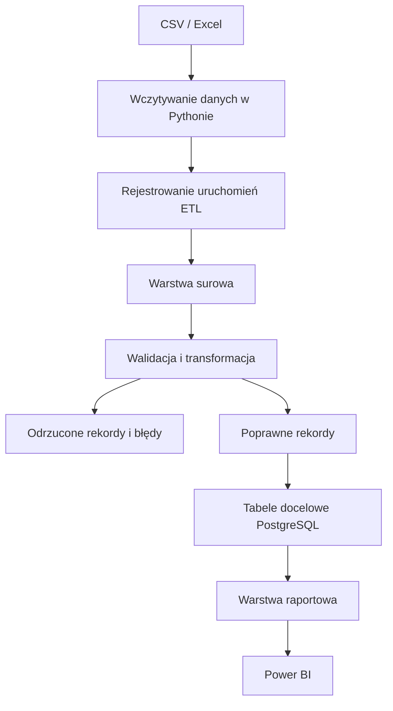
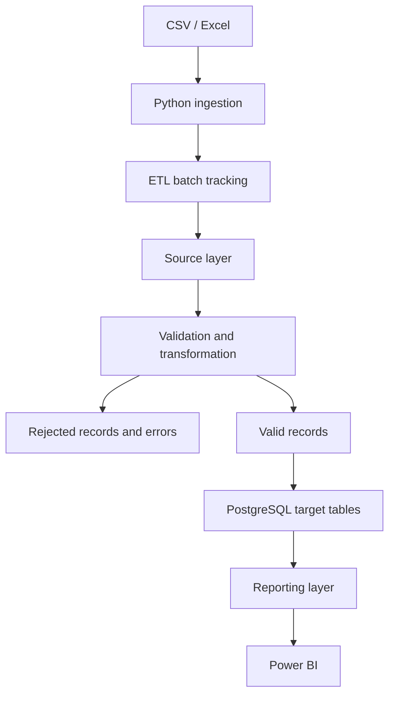

# TransactFlow ETL

[Polski](#polski) | [English](#english)

## Polski

TransactFlow ETL to projekt portfolio z obszaru inżynierii danych, wykorzystujący PostgreSQL i dane transakcyjne. Docelowo będzie stanowił kompletny proces ETL: od zachowania danych źródłowych, przez kontrolę jakości i rejestrowanie wykrytych naruszeń, po transformację oraz załadowanie poprawnych rekordów do relacyjnego modelu docelowego.

> **Status:** projekt jest w trakcie rozwoju. Repozytorium zawiera obecnie schemat bazy danych, warstwę surową, przykładowe dane CSV oraz zapytania SQL kontrolujące jakość danych. Automatyczne wczytywanie danych i ładowanie ich do tabel docelowych znajdują się w planie rozwoju.

### Docelowa architektura

Poniższy diagram przedstawia planowany przepływ danych, a nie aktualny stan implementacji.



### Aktualny stan repozytorium

- relacyjny schemat tabel `klienci` i `transakcje` z kluczami głównymi, ograniczeniem unikalności oraz kluczem obcym;
- tabela `transakcje_raw`, przechowująca wartości źródłowe jako `TEXT`, aby błędne dane nie blokowały importu;
- mały zestaw danych CSV zawierający poprawne i celowo błędne rekordy;
- zapytania SQL profilujące jakość danych przed transformacją;
- komentarze w plikach SQL prowadzone po polsku i angielsku.

### Zaimplementowane kontrole jakości

| Obszar | Kontrola |
|---|---|
| Wymagane pola | Wykrywanie wartości `NULL`, pustych pól i samych białych znaków |
| Identyfikator klienta | Wykrywanie `klient_id`, które nie występują w docelowej tabeli klientów |
| Unikalność | Wykrywanie duplikatów `external_id` |
| Format kwoty | Rozpoznawanie wartości liczbowych z kropką lub przecinkiem jako separatorem dziesiętnym |
| Zakres kwoty | Wykrywanie kwot mniejszych lub równych zero |
| Typ transakcji | Kontrola dozwolonych wartości po usunięciu spacji i normalizacji wielkości liter |
| Polskie znaki | Użycie kolacji `pg_unicode_fast` podczas normalizacji typów transakcji |
| Format daty | Kontrola oczekiwanej struktury `DD.MM.YYYY HH:MM:SS` |
| Nadmiarowe spacje | Normalizacja powtarzających się białych znaków przed walidacją daty |
| Poprawność daty | Odrzucanie wartości o prawidłowej strukturze, które nie są poprawną datą lub godziną |

### Elementy rozwijane lokalnie

Poniższe elementy nie znajdują się jeszcze w publicznej gałęzi `main`:

- tabela `etl_batches` do rejestrowania pliku źródłowego, czasu rozpoczęcia i zakończenia oraz statusu procesu;
- `batch_id` w warstwie surowej, powiązany kluczem obcym z `etl_batches`;
- tabela `transakcje_errors`, w której jeden wpis odpowiada jednemu naruszeniu reguły, dzięki czemu jeden rekord źródłowy może mieć kilka błędów;
- mechanizm `INSERT INTO ... SELECT` zapisujący wyniki walidacji;
- pierwsze kody błędów: `MISSING_AMOUNT`, `MISSING_CUSTOMER_ID` i `INVALID_CUSTOMER_ID`.

### Struktura repozytorium

```text
data/
└── transakcje_raw.csv          # przykładowe dane zawierające celowe błędy
sql/
├── 01_schema.sql              # docelowy schemat relacyjny
├── 02_raw_layer.sql           # warstwa surowa
└── 03_data_quality_checks.sql # zapytania profilujące jakość danych
README.md
LICENSE
.gitignore
```

### Technologie

- **Obecnie:** PostgreSQL, SQL, DBeaver, CSV, Git i GitHub
- **Planowane:** Python, pliki Excel, Power BI oraz opcjonalnie Docker

### Plan rozwoju

#### PostgreSQL i SQL

- połączenie reguł walidacji w jeden spójny mechanizm i zapis wszystkich naruszeń;
- wybór rekordów bez błędów oraz konwersja wartości `TEXT` do właściwych typów danych;
- ładowanie poprawnych rekordów do tabeli `transakcje`;
- aktualizacja statusu uruchomienia ETL oraz zapis liczby rekordów załadowanych, poprawnych i odrzuconych;
- ochrona przed ponownym przetwarzaniem danych;
- dodanie odpowiednich indeksów i transakcyjności.

#### Automatyzacja w Pythonie

- odczyt plików CSV, a następnie również `.xlsx`;
- połączenie z PostgreSQL i automatyczne utworzenie wpisu opisującego uruchomienie ETL;
- załadowanie danych do warstwy surowej oraz uruchomienie walidacji i transformacji;
- obsługa wyjątków i rejestrowanie zdarzeń;
- przechowywanie konfiguracji połączenia poza kodem, np. w pliku `.env`.

#### Dane i raportowanie

- pozostawienie obecnego pliku zawierającego 20 rekordów jako małego zestawu testowego do walidacji;
- wygenerowanie większego syntetycznego zestawu danych do testowania procesu i raportowania;
- utworzenie warstwy raportowej w PostgreSQL;
- przygotowanie dashboardów Power BI dotyczących transakcji oraz jakości procesu ETL.

---

## English

TransactFlow ETL is a data engineering portfolio project built around transaction data and PostgreSQL. Its target is an end-to-end pipeline that preserves source data, validates its quality, records every detected violation, transforms valid records and loads them into a relational target model.

> **Status:** in development. The repository currently contains the database schema, source layer, sample CSV data and SQL data-quality checks. Automated ingestion and target loading are part of the roadmap.

### Target architecture

The diagram presents the intended data flow, not the current implementation.



### Current public implementation

- a relational target schema with `klienci` and `transakcje` tables, primary keys, a uniqueness constraint and a foreign key;
- a `transakcje_raw` source table using `TEXT` columns so invalid source values do not block ingestion;
- a small CSV dataset containing valid and intentionally invalid records;
- SQL queries that profile data quality before transformation;
- bilingual Polish and English comments in the SQL files.

### Implemented data-quality checks

| Area | Check |
|---|---|
| Required fields | Detects `NULL`, empty and whitespace-only values |
| Customer reference | Detects `klient_id` values missing from the target customer table |
| Uniqueness | Detects duplicate `external_id` values |
| Amount format | Recognises numeric text with a dot or comma decimal separator |
| Amount range | Detects zero and negative amounts |
| Transaction type | Validates allowed values after trimming and case normalisation |
| Polish characters | Uses the `pg_unicode_fast` collation when normalising transaction types |
| Date format | Validates the expected `DD.MM.YYYY HH:MM:SS` structure |
| Whitespace | Normalises repeated whitespace before date validation |
| Timestamp validity | Rejects structurally correct but impossible dates or times |

### Work in progress

The following elements are being developed locally and are not yet available on the public `main` branch:

- `etl_batches` for tracking source files, start and finish times, and processing status;
- `batch_id` in the source layer, linked to `etl_batches` with a foreign key;
- `transakcje_errors`, using one row per rule violation so one source record may have multiple errors;
- `INSERT INTO ... SELECT` validation logic that persists detected errors;
- initial error codes including `MISSING_AMOUNT`, `MISSING_CUSTOMER_ID` and `INVALID_CUSTOMER_ID`.

### Repository structure

```text
data/
└── transakcje_raw.csv          # sample data containing intentional errors
sql/
├── 01_schema.sql              # relational target schema
├── 02_raw_layer.sql           # source layer
└── 03_data_quality_checks.sql # data-quality profiling queries
README.md
LICENSE
.gitignore
```

### Technologies

- **Currently used:** PostgreSQL, SQL, DBeaver, CSV, Git and GitHub
- **Planned:** Python, Excel files, Power BI and optionally Docker

### Roadmap

#### PostgreSQL and SQL

- consolidate validation rules into one process and persist every violation;
- identify records without errors and convert source text into appropriate data types;
- load valid records into the target `transakcje` table;
- update batch status and store loaded, valid and rejected row counts;
- prevent duplicate processing and add suitable indexes and transaction boundaries.

#### Python automation

- read CSV and later `.xlsx` source files;
- connect to PostgreSQL and create an ETL batch automatically;
- load data into the source layer and start validation and transformation;
- add exception handling and logging;
- store connection configuration outside the code, for example in a `.env` file.

#### Data and reporting

- keep the current 20-row file as a focused validation dataset;
- generate a larger synthetic dataset for testing and reporting;
- create a PostgreSQL reporting layer;
- build Power BI dashboards for transactions and ETL/data-quality metrics.

## License

This project is available under the MIT License.
