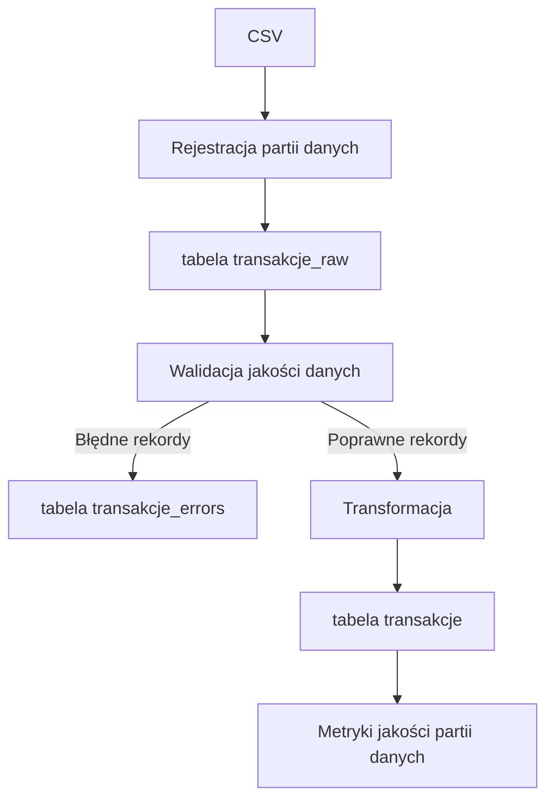
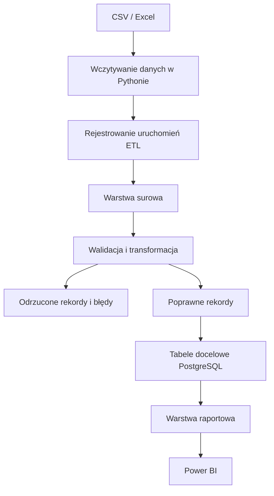
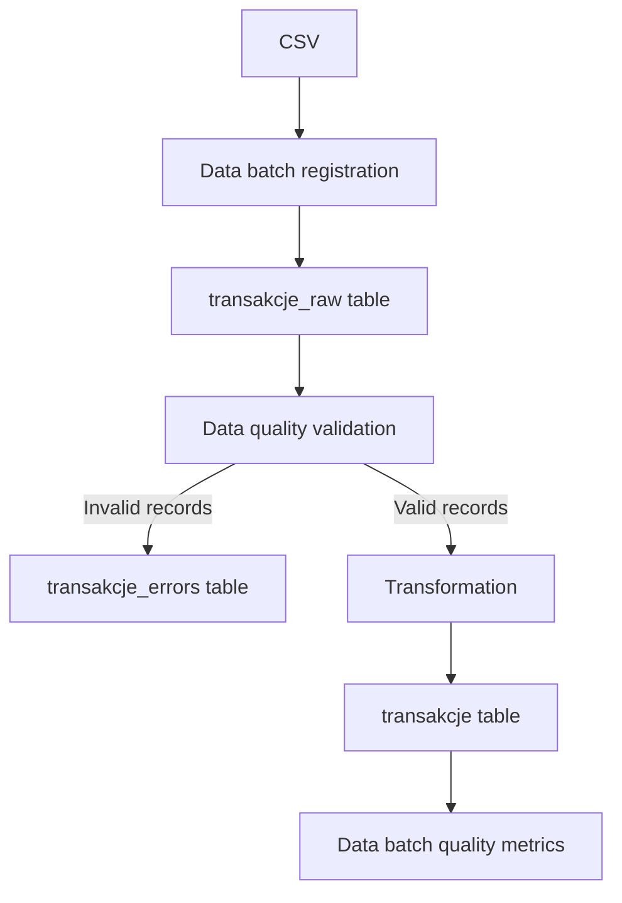

# TransactFlow ETL

[Polski](#polski) | [English](#english)

## Polski

TransactFlow ETL to projekt z zakresu inżynierii danych, którego celem jest praktyczne przedstawienie procesu ETL na danych transakcyjnych z wykorzystaniem PostgreSQL.

> **Status:** Obecna wersja projektu realizuje pełny przepływ ETL po stronie SQL, od rejestracji partii danych i warstwy surowej, przez walidację i obsługę błędów, po transformację, ładowanie poprawnych rekordów i podstawowe metryki jakości danych. Następnym krokiem będzie automatyzacja procesu w Pythonie.
<br>

### Aktualny przepływ danych

Obecna implementacja SQL realizuje następujący przepływ:


<br>

### Docelowa architektura

Poniższy diagram przedstawia planowany przepływ danych, a nie aktualny stan implementacji.


<br>

### Aktualny stan repozytorium

- relacyjna tabela referencyjna `klienci`;
- `etl_batches` do rejestrowania kolejnych partii danych i stanu procesu ETL;
- warstwa surowa `transakcje_raw`, przechowująca wartości źródłowe jako `TEXT`;
- powiązanie rekordów surowych z konkretną partią danych przez `batch_id`;
- profilowanie jakości danych przy użyciu zapytań SQL;
- tabela `transakcje_errors`, przechowująca wykryte naruszenia reguł jakości;
- spójny mechanizm walidacji oparty na `INSERT INTO ... SELECT` i `UNION ALL`;
- transformacja poprawnych rekordów do właściwych typów danych;
- ładowanie poprawnych rekordów do tabeli docelowej `transakcje`;
- śledzenie pochodzenia danych przez `source_raw_id`;
- zabezpieczenie przed wielokrotnym zapisaniem tych samych błędów i ponownym załadowaniem tych samych rekordów;
- rejestrowanie statusu rozpoczęcia i zakończenia procesu;
- zbiorcze metryki jakości dla pojedynczej partii danych;
- mały zestaw testowy zawierający poprawne i celowo błędne rekordy.
<br>

### Zaimplementowane kontrole jakości

| Obszar | Kontrola |
|---|---|
| Wymagane pola | Wykrywanie wartości `NULL`, pustych pól i samych białych znaków |
| Identyfikator klienta | Wykrywanie nieistniejących identyfikatorów klientów |
| Unikalność | Wykrywanie duplikatów `external_id` |
| Format kwoty | Rozpoznawanie wartości liczbowych z kropką lub przecinkiem jako separatorem dziesiętnym |
| Zakres kwoty | Wykrywanie kwot mniejszych lub równych zero |
| Typ transakcji | Kontrola dozwolonych wartości po usunięciu spacji i normalizacji wielkości liter |
| Polskie znaki | Użycie kolacji `pg_unicode_fast` podczas normalizacji typów transakcji |
| Format daty | Kontrola oczekiwanej struktury `DD.MM.YYYY HH:MM:SS` |
| Nadmiarowe spacje | Normalizacja powtarzających się białych znaków przed walidacją daty |
| Poprawność daty | Wykrywanie wartości o poprawnym formacie, ale nieprawidłowej dacie lub godzinie |
<br>

### Aktualnie rozwijane

Kolejny etap projektu obejmuje automatyzację procesu ETL w Pythonie:

- odczyt danych z plików CSV;
- połączenie z PostgreSQL;
- automatyczne tworzenie wpisu w `etl_batches` dla każdej nowej partii danych;
- ładowanie danych źródłowych do `transakcje_raw`;
- uruchamianie walidacji, transformacji i ładowania danych z poziomu Pythona;
- automatyczna obsługa statusów `STARTED`, `SUCCESS` i `FAILED`;
- obsługa wyjątków i rejestrowanie przebiegu procesu;
- przechowywanie konfiguracji połączenia poza kodem, np. w pliku `.env`.
<br>

### Struktura repozytorium

```text
data/
└── transakcje_raw.csv          # przykładowe dane zawierające celowe błędy
sql/
├── 01_schema.sql               # bazowe tabele projektu
├── 02_raw_layer.sql            # warstwa surowa danych transakcyjnych
├── 03_reference_data.sql       # przykładowe dane referencyjne klientów
├── 04_etl_tables.sql           # tabela błędów i tabela docelowa
├── 05_data_quality_checks.sql  # zapytania profilujące jakość danych
├── 06_validation.sql           # walidacja danych i zapis wykrytych błędów
├── 07_load.sql                 # transformacja i ładowanie poprawnych rekordów
└── 08_batch_metrics.sql        # metryki jakości partii danych
LICENSE
.gitignore
```
<br>

### Technologie

- **Obecnie:** PostgreSQL, SQL, DBeaver, CSV, Git i GitHub
- **Planowane:** Python, pliki Excel, Power BI oraz opcjonalnie Docker
<br>

### Plan rozwoju

#### Automatyzacja w Pythonie

- odczyt plików CSV, a następnie również `.xlsx`;
- połączenie z PostgreSQL i automatyczne utworzenie wpisu opisującego nową partię danych;
- załadowanie danych do warstwy surowej;
- uruchamianie walidacji, transformacji i ładowania z poziomu Pythona;
- automatyczna obsługa statusów `STARTED`, `SUCCESS` i `FAILED`;
- obsługa wyjątków i rejestrowanie przebiegu procesu;
- przechowywanie konfiguracji połączenia poza kodem, np. w pliku `.env`.

#### Dalszy rozwój SQL

- uniezależnienie walidacji dat od ustawienia sesji `DateStyle`;
- dodanie odpowiednich indeksów;
- objęcie procesu odpowiednimi transakcjami;
- dalsze rozwijanie metryk procesu ETL.

#### Dane i raportowanie

- pozostawienie obecnego pliku zawierającego 20 rekordów jako małego zestawu testowego do walidacji;
- przygotowanie większej partii danych do testowania kolejnych uruchomień procesu;
- utworzenie warstwy raportowej w PostgreSQL;
- przygotowanie dashboardów Power BI dotyczących transakcji oraz jakości procesu ETL.
<br>

## Licencja

Projekt jest udostępniany na licencji MIT.

<br>

---

## English

TransactFlow ETL is a data engineering project that demonstrates a practical ETL process using transaction data and PostgreSQL.

> **Status:** The current version implements the full ETL flow on the SQL side, from batch registration and the raw data layer, through validation and error handling, to transformation, loading of valid records and basic data quality metrics. The next step is to automate the process using Python.
<br>

### Current data flow

The current SQL implementation follows this flow:


<br>

### Target architecture

The diagram presents the intended data flow, not the current implementation.


<br>

### Current repository state

- relational `klienci` reference table;
- `etl_batches` for tracking individual data batches and ETL processing status;
- `transakcje_raw` raw layer storing source values as `TEXT`;
- association of raw records with a specific data batch through `batch_id`;
- SQL-based data quality profiling;
- `transakcje_errors` table storing detected data quality violations;
- consolidated validation logic based on `INSERT INTO ... SELECT` and `UNION ALL`;
- transformation of valid records into appropriate data types;
- loading of valid records into the target `transakcje` table;
- data lineage through `source_raw_id`;
- protection against duplicate error recording and duplicate target loading;
- tracking of process start and completion status;
- combined quality metrics for an individual data batch;
- a small test dataset containing valid and intentionally invalid records.
<br>

### Implemented data-quality checks

| Area | Check |
|---|---|
| Required fields | Detects `NULL`, empty and whitespace-only values |
| Customer reference | Detects customer identifiers that do not exist in the customer reference table |
| Uniqueness | Detects duplicate `external_id` values |
| Amount format | Recognises numeric text with a dot or comma decimal separator |
| Amount range | Detects zero and negative amounts |
| Transaction type | Validates allowed values after trimming and case normalisation |
| Polish characters | Uses the `pg_unicode_fast` collation when normalising transaction types |
| Date format | Validates the expected `DD.MM.YYYY HH:MM:SS` structure |
| Whitespace | Normalises repeated whitespace before date validation |
| Timestamp validity | Detects structurally correct values that do not represent a valid date or time |
<br>

### Work in progress

The next stage of the project focuses on automating the ETL process in Python:

- reading data from CSV files;
- connecting to PostgreSQL;
- automatically creating an entry in `etl_batches` for each new data batch;
- loading source data into `transakcje_raw`;
- running validation, transformation and loading from Python;
- automatically handling `STARTED`, `SUCCESS` and `FAILED` statuses;
- exception handling and process logging;
- storing connection configuration outside the code, for example in a `.env` file.
<br>

### Repository structure

```text
data/
└── transakcje_raw.csv          # sample data containing intentional errors
sql/
├── 01_schema.sql               # core project tables
├── 02_raw_layer.sql            # raw transaction data layer
├── 03_reference_data.sql       # sample customer reference data
├── 04_etl_tables.sql           # error and target tables
├── 05_data_quality_checks.sql  # data quality profiling queries
├── 06_validation.sql           # data validation and error recording
├── 07_load.sql                 # transformation and loading of valid records
└── 08_batch_metrics.sql        # data batch quality metrics
LICENSE
.gitignore
```
<br>

### Technologies

- **Currently used:** PostgreSQL, SQL, DBeaver, CSV, Git and GitHub
- **Planned:** Python, Excel files, Power BI and optionally Docker
<br>

### Roadmap

#### Python automation

- read CSV files and later support `.xlsx`;
- connect to PostgreSQL and automatically create an entry describing a new data batch;
- load data into the raw layer;
- run validation, transformation and loading from Python;
- automatically handle `STARTED`, `SUCCESS` and `FAILED` statuses;
- add exception handling and process logging;
- keep connection configuration outside the code, for example in a `.env` file.

#### Further SQL development

- make timestamp validation independent of the session `DateStyle` setting;
- add appropriate indexes;
- wrap the process in suitable database transactions;
- further extend ETL process metrics.

#### Data and reporting

- keep the current 20-row file as a small validation test dataset;
- prepare a larger data batch for testing subsequent ETL runs;
- create a PostgreSQL reporting layer;
- build Power BI dashboards for transaction data and ETL data quality.
<br>

## License

This project is available under the MIT License.
